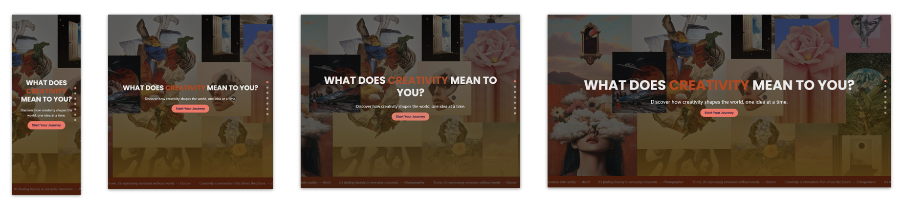

# Adaptive Web Design



Deployed at: https://biancam30.github.io/AWD/

This website was created as part of the **Adaptive Web Design** course. The theme assigned for this project was **Creativity**, and the goal was to build a fully responsive and adaptive single-word website.

The site explores the **neuroscience of creativity**, inspired by research from Arne Dietrich and others, covering both cognitive and emotional dimensions. From deliberate invention like Edison’s to spontaneous artistic bursts, the project presents creativity as a whole-brain phenomenon with rich contextual variations.

---

## Technical Overview

| Category                  | Details                                          |
|--------------------------|--------------------------------------------------|
| Framework                | React.js                                         |
| CSS Layout Techniques    | Flexbox, Media Queries                           |
| Fonts                    | Google Fonts – *Poppins*                         |
| Preprocessors            | None                                             |
| Images                   | Optimized using `pngcrush`                       |
| Validity                 | HTML Valid, CSS Valid, Accessibility Valid       |
| Browser Compatibility    | Chrome, Firefox, Edge, Safari                    |
| Responsiveness           | Fully responsive and adaptive                    |

---
## Responsive Design

This website was designed to adapt fluidly across:

- **Smartphones:** 320px  
- **Tablets:** 768px  
- **Netbooks:** 1024px  
- **Desktops:** 1600px  

The layout uses **Flexbox** and **media queries**, with adaptive components and resizable images for seamless user experience across all devices.

## Getting Started

To run the project locally:

1. Clone the repository:

```bash
git clone https://github.com/BiancaM30/AWD.git
cd AWD
```

2. Install dependencies:

```bash
npm install
```

3. Start the development server:

```bash
npm run dev
```
